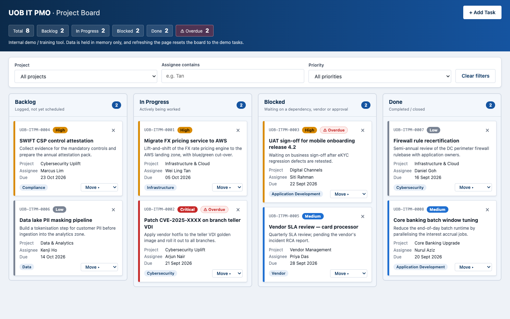

# UOB IT PMO Board

A single-file IT PMO Kanban board for internal demos and training. It shows how an IT project management office might track work across Backlog, In Progress, Blocked and Done. It is plain HTML, CSS and JavaScript with no build step and no dependencies.

**Live demo:** https://sambapodili.github.io/kanbanboard/

## Screenshot



## Features

- **Four columns** (Backlog, In Progress, Blocked, Done), each with a short hint and a task count.
- **Summary strip** in the header with totals per column and an overdue count.
- **Filters** by project, priority, and assignee (substring match), plus a "Clear filters" button. While filters are active, column counts show "shown / total".
- **Drag and drop** cards between columns, with a keyboard-friendly "Move ▸" dropdown on every card as a fallback.
- **Add Task dialog** with inline validation: title (max 80 chars), optional description (max 500), project, category, assignee, priority, due date and status. New tasks get IDs like `UOB-ITPM-0009`.
- **Inline delete confirmation** ("Delete? Yes / No") instead of browser pop-ups.
- **Overdue highlighting** for tasks whose due date has passed and that are not Done. Demo due dates are relative to today, so some cards are always overdue.
- **Email notification** of new tasks via a [FormSubmit](https://formsubmit.co/) AJAX POST (optional; see below). If it fails, the card is still added and a warning toast is shown.

### No persistence (on purpose)

The board keeps data in memory only. It does not use localStorage, sessionStorage, IndexedDB or cookies. Refreshing the page resets the board to the demo tasks, and the header says so.

## Running locally

Open `index.html` in a browser. It works straight from `file://`.

To test FormSubmit email delivery, serve the folder instead, because a `file://` page has a `null` origin:

```sh
python3 -m http.server
# then open http://localhost:8000/
```

### Configuring email notifications

Set `FORMSUBMIT_ENDPOINT` at the top of the `<script>` in `index.html`:

```js
const FORMSUBMIT_ENDPOINT = "https://formsubmit.co/ajax/YOUR_EMAIL@example.com";
```

While it still holds the `YOUR_EMAIL@example.com` placeholder, no request is sent and adding a task shows the "email notification failed" warning.

- FormSubmit needs a one-time activation: the first submission sends a confirmation email to the address, and nothing is delivered until you click the link in it.
- This repo and the Pages site are public. Anything you put in the endpoint is visible to everyone and can be used to send mail to that inbox. Prefer the random-string alias FormSubmit gives you after activation over a raw email address.

## Tech and constraints

- Vanilla HTML/CSS/JS in a single file (`index.html`). No frameworks, CDNs, web fonts, image files or build step.
- Icons are Unicode characters, and fonts use the system font stack.
- Colours and spacing come from CSS custom properties on `:root`.
- The only network call is the FormSubmit POST. The page never navigates away.

## Accessibility

- Every form field has a `<label for>`, and icon-only buttons have an `aria-label`.
- Form errors are shown inline next to the field.
- Toasts are announced through an `aria-live="polite"` region.
- Priority is shown as text as well as colour.
- Cards can be moved with the keyboard using the "Move ▸" dropdown, and focus is kept after each update.

## Deployment

GitHub Pages is deployed by the GitHub Actions workflow in [`.github/workflows/pages.yml`](.github/workflows/pages.yml). It runs on every push to `main` (or manually), and publishes only `index.html`, not repo files such as `CLAUDE.md`.

## Disclaimer

This is a training and demo project. It is not affiliated with, endorsed by, or an official system of United Overseas Bank (UOB). "UOB IT PMO" is a plain text label only. No real logos or trademarks are used, and all tasks and names in the demo data are fictional.
