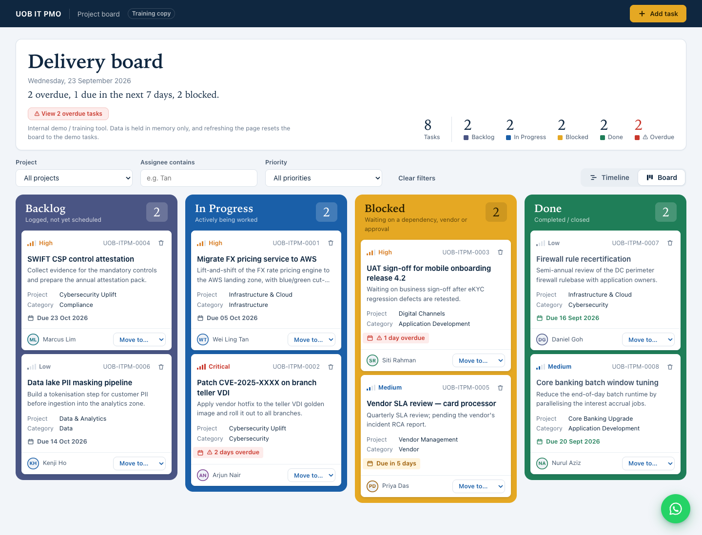
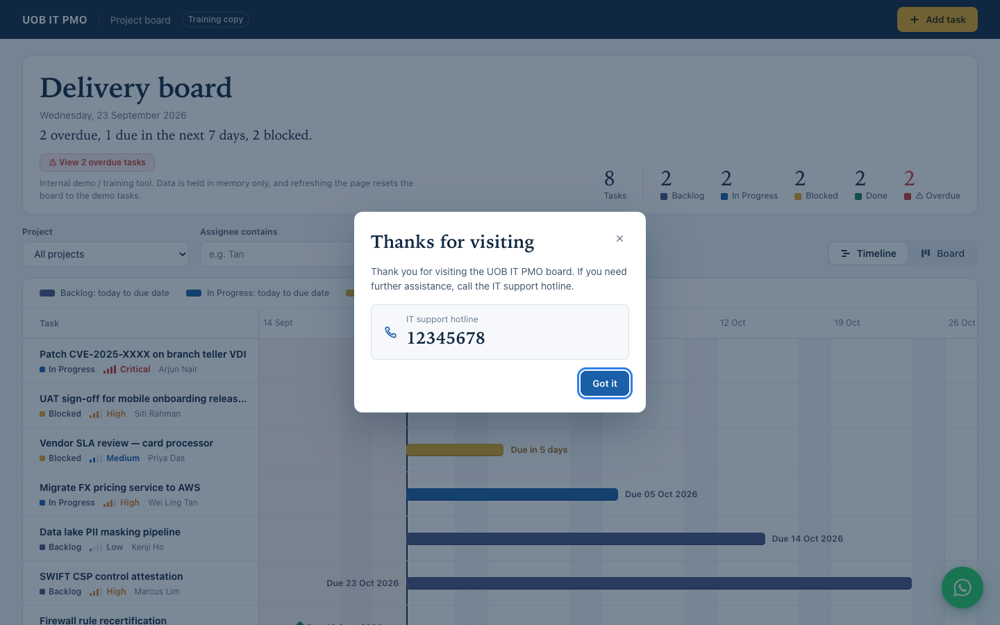

# UOB IT PMO Board

A single-file IT PMO Kanban board for internal demos and training. It shows how an IT project management office might track work across Backlog, In Progress, Blocked and Done. It is plain HTML, CSS and JavaScript with no build step and no dependencies.

**Live demo:** https://sambapodili.github.io/kanbanboard/

## Screenshots

**Timeline view** (default): each task plotted by due date, with overdue days in red.


**Board view**: the four Kanban lanes with drag and drop.



**Help popup**: after 10 seconds on the page, visitors see the IT support hotline.



## Features

- **Four colour lanes** (Backlog, In Progress, Blocked, Done), like tape on a physical kanban wall, each with a short hint and a task count.
- **Overview** with the date, a one-line status sentence ("2 overdue, 1 due in the next 7 days, 2 blocked."), and live counts per lane and overdue.
- **Two views, one toggle.** *Timeline* (the default) is a Gantt chart with one row per task, sorted by due date. Open tasks get a bar from today to the due date in their lane colour, overdue tasks get a red striped bar for the days past due, and Done tasks are a diamond on their due date. Weekends, week lines, the past and "Today" are marked. Clicking a task opens the *Board* view on its card. *Board* is the Kanban board with the four colour lanes. Filters apply to both views.
- **Task cards** showing priority as text plus a four-step signal meter, project, category, the assignee's initials, and a due-date label ("2 days overdue", "Due in 5 days", or the date).
- **Filters** by project, priority, and assignee (substring match), plus a "Clear filters" button. While filters are active, column counts show "shown / total".
- **Drag and drop** cards between columns, with a keyboard-friendly "Move to…" dropdown on every card as a fallback.
- **Add Task dialog** with inline validation: title (max 80 chars), optional description (max 500), project, category, assignee, priority, due date and status. New tasks get IDs like `UOB-ITPM-0009`.
- **Inline delete confirmation** ("Delete? Yes / No") instead of browser pop-ups.
- **Overdue highlighting** for tasks whose due date has passed and that are not Done, plus a "Due in 5 days"-style label for tasks due within a week. Demo due dates are relative to today, so some cards are always overdue.
- **Overdue list**: a "⚠ View N overdue tasks" button in the overview (it reads "✓ No overdue tasks" and is disabled when there are none) opens a dialog listing every overdue task, most overdue first, with days late, ID, status, priority, assignee and due date. It ignores the filters. "Show on board" jumps to that card, clearing any filter that hides it.
- **Help popup**: after 10 seconds on the page (visible time only), a dialog thanks the visitor and shows the IT support hotline (`12345678`, a tap-to-call link on phones). It waits while any other dialog is open and shows once per page load. Change `HELP_PROMPT_DELAY_MS` and `SUPPORT_HOTLINE` at the top of the `<script>`.
- **WhatsApp IT support**: a floating button at the bottom right opens a list of common IT support questions. Picking one opens a WhatsApp chat with +65 1234 5678 in a new tab, with the question pre-filled; there is also a "Start a blank chat" link. Change `WHATSAPP_NUMBER` and `SUPPORT_QUERIES` at the top of the `<script>`.
- **Email notification** of new tasks via a [FormSubmit](https://formsubmit.co/) AJAX POST (optional; see below). If it fails, the card is still added and a warning toast is shown.

### No persistence (on purpose)

The board keeps data in memory only. It does not use localStorage, sessionStorage, IndexedDB or cookies. Refreshing the page resets the board to the demo tasks, and the header says so.

## Running locally

Open `index.html` in a browser. It works straight from `file://`.

To test FormSubmit email delivery, serve the folder instead, because a `file://` page has a `null` origin:

```sh
python3 -m http.server
# then open http://localhost:8000/
```

### Configuring email notifications

Set `FORMSUBMIT_ENDPOINT` at the top of the `<script>` in `index.html`:

```js
const FORMSUBMIT_ENDPOINT = "https://formsubmit.co/ajax/YOUR_EMAIL@example.com";
```

While it still holds the `YOUR_EMAIL@example.com` placeholder, no request is sent and adding a task shows the "email notification failed" warning.

- FormSubmit needs a one-time activation: the first submission sends a confirmation email to the address, and nothing is delivered until you click the link in it.
- This repo and the Pages site are public. Anything you put in the endpoint is visible to everyone and can be used to send mail to that inbox. Prefer the random-string alias FormSubmit gives you after activation over a raw email address.

## Tech and constraints

- Vanilla HTML/CSS/JS in a single file (`index.html`). No frameworks, CDNs, web fonts, image files or build step.
- Icons are Unicode characters or inline SVG. Fonts are system fonts only: a system serif (Iowan Old Style, Charter or Georgia) for headings and numbers, and the system sans for everything else.
- Responsive layout: four lanes on wide screens, two below 1180px, one on phones (the timeline scrolls sideways there). The dialog animation is turned off for users who prefer reduced motion.
- Colours and spacing come from CSS custom properties on `:root`.
- The only network call is the FormSubmit POST. The page never navigates away: WhatsApp links open `wa.me` in a new tab (`rel="noopener noreferrer"`) only when the user clicks one.

## Accessibility

- Every form field has a `<label for>`, and icon-only buttons have an `aria-label`.
- Form errors are shown inline next to the field.
- Toasts are announced through an `aria-live="polite"` region.
- Priority is shown as text as well as colour.
- Cards can be moved with the keyboard using the "Move to…" dropdown, and focus is kept after each update.

## Deployment

GitHub Pages is deployed by the GitHub Actions workflow in [`.github/workflows/pages.yml`](.github/workflows/pages.yml). It runs on every push to `main` (or manually), and publishes only `index.html`, not repo files such as `CLAUDE.md`.

## Disclaimer

This is a training and demo project. It is not affiliated with, endorsed by, or an official system of United Overseas Bank (UOB). "UOB IT PMO" is a plain text label only. No real logos or trademarks are used, and all tasks and names in the demo data are fictional.
